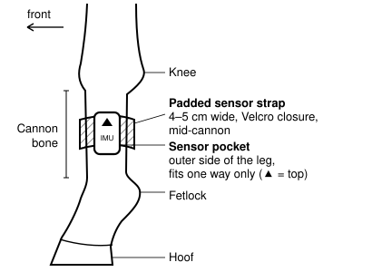
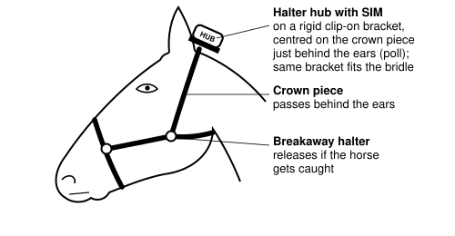
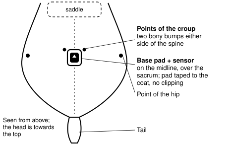

# EquiCare — Sensor requirements for steps, lameness, watering and feeding

**To:** Sparsh CCTV
**From:** Bharat Sports Venture — EquiCare engineering
**Date:** 29 September 2026
**Covers the remaining client monitoring points:** Steps/locomotion · Lameness/limb-favoring · Watering (quantity/pattern/time) · Feeding (quantity/pattern/time)

---

## 1. Background

The thermal + colour camera you supplied covers **8 of the client's 12 monitoring points**: body
temperature, respiration pattern, respiratory rate, general activity/abnormalities, resting
pattern and duration, stable vices (weaving), urination pattern and excretion pattern.

This document covers the **remaining four points**. For each point it states what we need to
measure, **how many sensors**, and **exactly where each sensor is placed**. We would like Sparsh
to supply these sensors, or to source them for us.

**All analytics are done by our software** — step counting, gait and lameness analysis, intake
patterns and alerts. From the sensors we need **raw, timestamped data** and a **documented way to
receive it**. We are not buying analytics, apps or a dashboard.

The sensors worn by the horse must send data **live, including when the horse is outside the
barn** for an hour or more of exercise. For that, one of the horse's devices carries a **mobile
SIM** (section 5).

---

## 2. Summary — what goes on each horse and in each stall

**On each horse (3 devices):**

| Device | Qty | Exact position | Worn | Points served |
|---|---|---|---|---|
| **A. Leg tag** (motion sensor, IMU) | 1 | Outside (lateral) face of the **left front cannon bone**, midway between knee and fetlock — **in a soft padded sensor strap** | 24/7 | Steps; lameness (stride timing); limb-favoring of that leg |
| **B. Halter hub with SIM** (motion sensor + LTE-M / NB-IoT modem) | 1 | Centred on the **crown piece of the halter**, just behind the ears (the poll) — **on a clip-on bracket** that moves to the **bridle's crown piece** for ridden work | 24/7 | **Live data for all three devices**; lameness (head movement) |
| **C. Pelvis sensor** (motion sensor, IMU) | 1 | On the **midline of the croup**, over the sacrum, between the two points of the croup — **snapped onto a base pad taped to the coat** | Exercise and trot-ups | Lameness (hind legs) |

**In each stall (3 fixed sensors):**

| Device | Qty | Exact position | Points served |
|---|---|---|---|
| **D. Water meter** — flow meter on the automatic drinker's supply pipe (or a weighed bucket where buckets are used) | 1 | On the supply pipe **just before the stall's automatic drinker**, outside the horse's reach | Watering |
| **E. Weigh-back feeder** — load cell under the feed bowl | 1 | Feed bowl at the **stall front**, rim at chest height (0.9–1.1 m); hopper and electronics on the **aisle side** of the wall | Feeding (concentrates) |
| **F. Hay load cell** | 1 | In the **hanging point of the hay net or hay rack** (ceiling beam or wall hook) | Feeding (hay / forage) |

**All three horse devices must be supplied already fitted in their mounts** (section 9): nothing
is invasive — no clipping, no needles, nothing implanted.

**Shared per site:** our on-site computer (edge box, NVIDIA Jetson) — supplied by us. The stall
sensors (D, E, F) connect to it by cable; the horse's sensors (A, B, C) reach our server over the
mobile network through the hub.

---

## 3. Requirements common to all sensors

| # | Requirement | Target |
|---|---|---|
| C1 | **Documented, open protocol**, with the protocol document / register map **sent with your reply** | Modbus RTU/TCP (RS-485), pulse, MQTT or HTTPS; BLE GATT between horse devices |
| C2 | **No mandatory vendor cloud** in the data path | Data reaches **our** server / edge box only; data stays in India (DPDP-2023) |
| C3 | **Raw data** available, not only summaries | Per-axis motion waveforms; per-event water and feed amounts |
| C4 | **Timestamps on the device** | Clock synchronised by NTP / network time; state drift over 24 h |
| C5 | **Buffering** when the link is lost | **≥24 h**, replayed with the **original timestamps** |
| C6 | **Per-reading status / quality flag** | e.g. valid, saturated, in motion, sensor fault |
| C7 | **Unique, fixed hardware ID** in every record | Bindable to one horse / one stall through the API |
| C8 | **India approvals** | **WPC/ETA** for every radio, **TEC (MTCTE)** for the SIM device, **BIS** |
| C9 | **Environment** | **IP67** for horse-worn devices, **IP66/67** for stall devices; 0–50 °C; monsoon humidity; daily wash-down; ammonia |
| C10 | Any software for our on-site computer | Built and tested for **Linux ARM64 (NVIDIA Jetson)** — or an open protocol that needs none |

---

## 4. Point 1 — Steps / locomotion

### 4.1 What we will measure
Steps per minute, hour and day; walking, trotting and cantering time; movement in the stall at
night — **24/7**, in the stall **and** outside it during exercise.

### 4.2 Sensors needed
**1 leg tag (device A)** per horse. The same tag also serves lameness (section 6).

### 4.3 Exact placement
- **Left front leg**, on the **outside (lateral) face of the cannon bone**, midway between the
  knee and the fetlock joint.
- Supplied **fitted in a soft padded sensor strap** (section 9.1): the sensor sits in a closed
  pocket on the outside of the leg, and the strap closes with hook-and-loop. It must sit flat and
  not rotate around the leg; strap and case show which way is **up** and which way is
  **forward**.
- **The same leg on the same horse every day**, so that the data stays comparable.
- Removable in seconds for grooming, bandaging and charging.

### 4.4 Live data
Leg tag → (Bluetooth, on the horse) → **halter hub with SIM** → (mobile network) → our server.
See section 5.

### 4.5 Requirements

| # | Requirement | Target |
|---|---|---|
| S1 | Motion sensor | **6-axis** minimum (3-axis accelerometer + 3-axis gyroscope); 9-axis preferred. Part number + datasheet |
| S2 | Accelerometer range | **≥ ±16 g** (kicks against the stall wall must not clip) |
| S3 | Gyroscope range | **≥ ±2000 °/s** |
| S4 | Sample rate | **≥100 Hz**, configurable remotely |
| S5 | Raw per-axis data | Available to us; any on-tag step counting or activity classification can be **switched off** |
| S6 | Step counting (if you provide it) | State whether it is **validated on horses**, and its error at walk and trot |
| S7 | Weight and size | **≤50 g**; state dimensions |
| S8 | Battery | **≥7 days** at 100 Hz, or rechargeable with a hot-swap spare so no data is lost |
| S9 | Mount | Supplied in the **padded sensor strap** of section 9.1, sizes **pony to draft horse** |
| S10 | Detach alert | Hub reports **immediately** when the tag goes silent or comes off |
| S11 | Protection | **IP67** or better; survives mud, urine, manure, sweat and hosing |

---

## 5. Live data — the halter hub with SIM

### 5.1 Why
When the horse leaves the barn for exercise (arena, lunging, rides), Bluetooth loses the barn.
We have decided on a **device with a mobile SIM** so that the horse stays monitored **live**
wherever there is mobile coverage.

### 5.2 Sensors needed
**1 halter hub (device B)** per horse. It contains its **own motion sensor** (used for lameness,
section 6), a **mobile modem with SIM**, and a larger battery. The leg tag and pelvis sensor stay
small and light because the hub does the long-range sending for them.

### 5.3 Exact placement
- Centred on the **crown piece of the halter**, just behind the ears (the poll), on a
  **low-profile clip-on bracket** (section 9.2) — rigid, so the hub cannot turn or swing (its head
  measurements depend on that).
- For ridden work the horse wears a bridle: the hub must **move to the bridle's crown piece in
  seconds** on the same bracket, and sit in the same position.
- For 24/7 wear the halter must be a **breakaway halter** (it releases if the horse catches it).
- It must not press on the poll or rub, and must not catch on stall fittings.

### 5.4 What it does
- Collects the leg tag's and pelvis sensor's data over Bluetooth, and adds its own.
- Sends to **our server** over **LTE-M and/or NB-IoT**, with a fallback (e.g. LTE Cat-1) where
  those are not available.
- Sends **summaries at least once a minute** while the horse is active (steps, activity,
  lying/standing, and per-stride measures during trot), and **alerts immediately** (device
  removed, a sensor silent).
- Delivers the **raw waveforms** afterwards — over the mobile link, or offloaded over Bluetooth /
  Wi-Fi when the horse is back in the barn.
- Keeps everything it cannot send (**≥24 h**) and fills gaps later with the original timestamps.

### 5.5 Requirements

| # | Requirement | Target |
|---|---|---|
| H1 | Mobile modem | **LTE-M and/or NB-IoT**, with a fallback; module part number; **networks and bands tested in India** |
| H2 | Sending to our server | **MQTT or HTTPS over TLS** to an **address we configure**; documented payload with field names and units (sample attached) |
| H3 | SIM | Physical SIM or eSIM; we prefer to **choose the operator** / use our own SIM |
| H4 | Mobile data | State **MB per horse per day** — in the stall, and during 1 h of exercise |
| H5 | Reporting | Summaries **≤1 min** apart; alerts immediately; state end-to-end delay |
| H6 | Its own motion sensor | Same as the leg tag (S1–S3), sample rate **200 Hz** preferred (head movement at trot) |
| H7 | Weight | **≤150 g** (our target — state yours) |
| H8 | Battery | **≥7 days** with summaries every minute (our target — state actual at 1-min and 5-min reporting); power-saving (PSM / eDRX) |
| H9 | Location (optional) | GPS/GNSS for position, speed and distance on rides — can be **switched off** |
| H10 | Updates | Firmware and settings **updated remotely over the mobile link** |
| H11 | Approvals | **TEC (MTCTE)**, **WPC/ETA**, **BIS** |
| H12 | Exercise scenario | The horse is out **1–2 hours** with patchy coverage: state exactly what is sent live, what is stored, how gaps are filled, and whether anything can be lost |

---

## 6. Point 2 — Lameness / limb-favoring

### 6.1 How we will measure it
Our software measures lameness while the horse **trots in a straight line on firm ground** (a
vet's trot-up, or straight stretches during exercise):
- A horse lame in a **front leg nods its head** — the head rises as the sore leg lands. The
  **head sensor** (hub) measures this.
- A horse lame in a **hind leg hikes its hip** on the sore side. The **pelvis sensor** measures
  this.
- The **leg tag** gives the exact moment each stride lands, which tells us **left from right**.
- At rest in the stall, the leg tag also shows **limb-favoring** of its leg (pointing, resting,
  shifting weight off it).

Each horse is compared with its own normal; a change is flagged for a vet to examine. The
sensors must therefore provide **clean, well-synchronised raw motion data** from all three
positions.

### 6.2 Sensors needed
**3 per horse**, two of which are already listed:
- **Head:** the **halter hub** (device B) — no extra device.
- **Front leg:** the **leg tag** (device A) — no extra device.
- **Pelvis:** **1 pelvis sensor (device C)** — the only additional device. It is worn **during
  exercise and trot-ups**, not 24/7.

*The leg tag and the pelvis sensor can be the **same product** with a different mount.*

### 6.3 Exact placement
- **Head:** the hub, centred on the halter or bridle crown piece at the poll (section 5.3).
- **Pelvis:** on the **midline of the croup, over the sacrum, between the two points of the
  croup**. The sensor **snaps onto a thin base pad** that is stuck to the coat with **horse-safe
  double-sided tape** — no clipping — and peeled off after the session (section 9.3). It must stay
  in place at **canter** and not move on the skin.
- **Front leg:** the leg tag, as in section 4.3.

### 6.4 Requirements

| # | Requirement | Target |
|---|---|---|
| L1 | Motion sensor (pelvis) | Same as the leg tag (S1–S3) |
| L2 | Sample rate (head and pelvis) | **200 Hz** preferred, 100 Hz minimum |
| L3 | Timing between the three devices | Aligned within **≤10 ms** of each other; state how |
| L4 | Live summaries | The hub can send per-stride measures during trot, or forwards data for our server to compute |
| L5 | Raw data | Full raw waveforms of each exercise session reach us, **within hours** at most |
| L6 | Pelvis sensor battery | **≥4 h** of continuous recording per charge |
| L7 | Pelvis mount | Supplied with the **snap-on base pads and tape** of section 9.3; stays in place at canter; no skin damage |
| L8 | Quick pairing | The pelvis sensor can be **paired to a different horse** in under a minute (one sensor may be shared between horses exercised at different times) |
| L9 | Validation data | Any equine gait or lameness data against a **vet's lameness grading**, if available |

*Out of scope for now: measuring the actual load on each leg (force plate).*

---

## 7. Point 3 — Watering (quantity / pattern / time)

### 7.1 What we will measure
Every **drinking bout** — start time, end time and **millilitres** — the daily total, and the
pattern across the day, **per horse** (one stall = one horse). A **refill** must be recorded
separately from **drinking**.

### 7.2 Sensors needed
**1 per stall**, one of:
- **Option A (preferred): an inline flow meter** — electromagnetic or hall-effect — on the supply
  pipe of the stall's **automatic drinker**. The drinker refills as the horse drinks, so the water
  flowing in equals the water drunk (less small spills).
- **Option B: a weighed bucket** — a load cell in the bucket's wall bracket — for stalls that use
  buckets instead of an automatic drinker. Drinking shows as weight falling; refills as a jump
  upwards.

### 7.3 Exact placement
- **Option A:** on the incoming pipe **immediately before the drinker's valve**, on the **aisle
  side of the stall wall**, or inside a steel enclosure **above 1.8 m**. No part of the meter or its
  cable within the horse's reach.
- **Option B:** load cell in a steel wall bracket with the bucket rim at **0.9–1.1 m** (chest
  height); load cell and cable behind a steel guard.

### 7.4 Connection
Fixed in the stall, so **by cable** — RS-485 / Modbus (or pulse output) — to our on-site computer.
**No SIM needed.**

### 7.5 Requirements

| # | Requirement | Target |
|---|---|---|
| W1 | Measuring principle | Electromagnetic or hall-effect, **no or few moving parts**; or load cell (option B) |
| W2 | Resolution | **≤10 ml** per pulse / step (our target — state yours) |
| W3 | Accuracy | **±2–3 %** across **0.1–8 L/min** (our target — state yours) |
| W4 | Smallest flow measured | **≤0.1 L/min** — slow sips must not read as zero |
| W5 | Bouts and refills | Each **drinking bout** timestamped with its volume; **refills separate** (option B) |
| W6 | Water quality | Food-grade wetted parts; tolerant of **hard Indian groundwater**, scale and hay debris; state cleaning interval |
| W7 | Output | **Modbus RTU/TCP (RS-485)** or pulse; register map attached |
| W8 | Power | 12–24 V DC or PoE; state watts |
| W9 | Protection | **IP66/67**; corrosion-resistant; survives daily wash-down |
| W10 | Load cell (option B) | Resolution **≤10 g**, capacity ≥25 kg, rejects nudging and leaning; state drift over 24 h |

---

## 8. Point 4 — Feeding (quantity / pattern / time)

### 8.1 What we will measure
For each meal: **grams offered**, **grams eaten** and **grams refused** (left over), with times,
plus **hay eaten** across the day — the pattern and timing per horse. A horse leaving its feed is
one of the earliest signs of illness, so **what was refused matters as much as what was given**.

### 8.2 Sensors needed
**2 per stall:**
- **1 weigh-back feeder (device E)** for concentrates (pellets, grain, mixes): it weighs what is
  in the bowl before and after each meal. An automatic dispenser with a per-horse schedule is
  preferred; a weighed bowl filled by hand is acceptable.
- **1 hay load cell (device F)** for forage, since horses eat mostly hay.

### 8.3 Exact placement
- **Feeder:** mounted at the **stall front or front corner**, bowl rim at **0.9–1.1 m** (chest
  height), with the **load cell under the bowl**. Hopper, motor and electronics on the **aisle side
  of the wall**, out of the horse's reach. The bowl must lift out for daily washing.
- **Hay:** load cell in the **hanging point of the hay net or hay rack** — the ceiling beam or wall
  hook where the net hangs today. Where hay is fed from the floor, a **weighed hay box** instead.

### 8.4 Connection
By cable — **RS-485 / Modbus** — to our on-site computer. **No SIM needed.**

### 8.5 Requirements

| # | Requirement | Target |
|---|---|---|
| F1 | Feed bowl weighing | Resolution **≤10 g**; accuracy **±20 g** (our target — state yours) |
| F2 | Weigh-back | Records **offered and left over** per meal, with times |
| F3 | Dispensing (if automatic) | Per-horse schedule (morning / midday / evening) set **through the local API**; each dispense recorded with scheduled vs actual time and grams |
| F4 | Faults | Hopper empty, jam and motor stall reported as **separate alarms** |
| F5 | Hay load cell | Capacity **≥20 kg**, resolution **≤50 g**; separates eating from the net swinging |
| F6 | Nudging and leaning | Short spikes (horse pushing the bowl or net) rejected without losing real eating |
| F7 | Output | **Modbus RTU/TCP (RS-485)**; register map attached |
| F8 | Hygiene | Feed-contact parts food-grade, removable and disinfectant-safe **without re-calibration** |
| F9 | Protection | **IP66/67**; kick, bite and lean resistant; electronics outside the stall |
| F10 | Power | 12–24 V DC or PoE; state watts |

*Until these sensors are installed, stable staff log feed and water in our software; the sensor
data will use the same records.*

---

\pagebreak

## 9. Mounting — sensors supplied already fitted

We expect **each horse device delivered ready to wear, fitted in its mount**, with the mount
designed together with the sensor. All mounts are **non-invasive**: no clipping, no needles,
nothing implanted.

### 9.1 Leg tag — soft padded sensor strap

- A **padded strap about 4–5 cm wide** around the cannon bone, closed with **hook-and-loop**
  (Velcro), with the sensor in a **closed pocket on the outside (lateral) face** of the leg.
- The pocket is **shaped so the sensor fits only one way**, and the strap is marked **top** and
  **front** — so the sensor sits at the same place and angle every time it is put on.
- Why a strap and not a bandage: bandages must be re-wrapped every 12–24 hours, uneven wrapping
  can injure the tendons, and each re-wrap moves the sensor. A shaped strap goes on the same way
  every time, in seconds.

### 9.2 Halter hub — clip-on bracket on the crown piece

- A **rigid, low-profile bracket** that clips onto the crown piece of a standard halter **and** of
  a bridle, with a **quick-release** — so the same hub moves from halter to bridle in seconds.
- The hub sits **centred just behind the ears**, cannot turn or swing, and does not press on the
  poll.
- For 24/7 wear, a **breakaway halter** (supply one, or confirm the bracket fits common breakaway
  halters).

\pagebreak

### 9.3 Pelvis sensor — snap-on base pad

- A **thin, flexible base pad** stuck to the coat over the croup midline with **horse-safe
  double-sided tape**; the sensor **snaps onto the pad** and comes off in one movement.
- The pad is **single-use** or re-usable with fresh tape; it peels off after the session without
  pulling hair or marking the skin.

### 9.4 Requirements for all mounts

| # | Requirement | Target |
|---|---|---|
| M1 | Delivered fitted | Each sensor arrives **in its mount**, ready to put on the horse |
| M2 | Sizes | Leg strap **pony, horse, draft** (or adjustable across that range); bracket fits standard halters and bridles |
| M3 | Materials | Breathable, **non-abrasive, hypoallergenic** padding; no metal or hard edges against the skin |
| M4 | Safety | **Low profile, rounded edges**, nothing that can catch on stall fittings; sensors on the **outside** of the leg only (the inside is hit by the other hoof) |
| M5 | Orientation | Pocket / bracket / pad **keyed** so the sensor fits one way only; **top** and **front** marked |
| M6 | Fitting time | Each device **on or off in under 30 seconds** by stable staff |
| M7 | Hold | Stays in place through **rolling, lying down, turnout and canter** without slipping or rotating |
| M8 | Cleaning | Straps **machine-washable**; bracket and pad wipe-clean and disinfectant-safe |
| M9 | Spares and wear | State strap service life; **spare straps** per horse so one can be washed; base pads and tape as consumables |
| M10 | Fitting guide | Illustrated fitting instructions, including how tight (a finger's width under the strap) |
| M11 | Welfare | Any evidence of 24/7 wear on horses without rubbing or sores (leg and halter) |

---

## 10. What we need from Sparsh

1. **For each device (A–F):** datasheet, **the actual protocol document / register map**, and a
   **sample data file recorded from the exact model** you would supply.
2. **Your answer to every requirement row** above (C1–C10, S1–S11, H1–H12, L1–L9, W1–W10,
   F1–F10, M1–M11): the value you meet, or **"not supported"**. A row left blank is recorded as not
   supported.
3. **India certificates** (WPC/ETA, TEC/MTCTE, BIS), or their status.
4. **Evaluation units for one horse and one stall**, horse devices **fitted in their mounts**:
   3 leg tags in padded straps (with spare straps), 2 halter hubs with SIMs that work in India on
   clip-on brackets (plus a breakaway halter), 1–2 pelvis sensors with base pads and tape,
   1 charging dock, 1 water meter (or weighed bucket), 1 weigh-back feeder, 1 hay load cell —
   with **availability and lead time**.
5. A **named technical contact** for clarifications.

**One request from the camera integration:** the camera documentation described one protocol
(ISAPI) while the unit runs another (JSON-RPC), and the SDK arrived for x86-64 only. So please
send the **documents and sample data for the exact model and firmware you will ship**, and say
plainly where something is not available. That lets us plan correctly from the start.

*Commercial terms are not part of this document — we will discuss them once the technical fit
is confirmed.*
